# tclmcairo — Cairo Samples

Tcl ports of the official [Cairo samples](https://cairographics.org/samples/).
Original C code by Øyvind Kolås — **public domain**.

```bash
# Run all samples:
cd examples
TCLMCAIRO_LIBDIR=.. tclsh8.6 run_all.tcl

# Single sample:
TCLMCAIRO_LIBDIR=.. tclsh8.6 arc.tcl   # -> arc.png
```

---

## arc

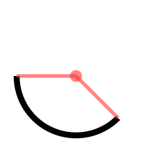

Arc with helping lines showing start/end angles and radii.

*Cairo API: `cairo_arc()` · `cairo_fill()`*

```tcl
set PI 3.14159265358979

set xc 128.0; set yc 128.0; set radius 100.0
set a1 45.0;  set a2 180.0

set cr [tclmcairo::new 256 256]
$cr clear 1 1 1

# Main arc
$cr arc $xc $yc $radius $a1 $a2 -stroke {0 0 0} -width 10

# Center dot (helping)
$cr circle $xc $yc 10 -fill {1 0.2 0.2 0.6}

# Radii (helping)
set hcol {1 0.2 0.2 0.6}
$cr line $xc $yc \
    [expr {$xc + $radius*cos($a1*$PI/180)}] \
    [expr {$yc + $radius*sin($a1*$PI/180)}] \
    -color $hcol -width 6

$cr line $xc $yc \
    [expr {$xc + $radius*cos($a2*$PI/180)}] \
    [expr {$yc + $radius*sin($a2*$PI/180)}] \
    -color $hcol -width 6
```

---

## arc negative

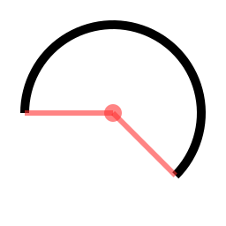

Counter-clockwise arc (`arc_negative`) with helping lines.

*Cairo API: `cairo_arc_negative()`*

```tcl
set PI 3.14159265358979

set xc 128.0; set yc 128.0; set radius 100.0
set a1 45.0;  set a2 180.0

set cr [tclmcairo::new 256 256]
$cr clear 1 1 1

$cr arc_negative $xc $yc $radius $a1 $a2 -stroke {0 0 0} -width 10

set hcol {1 0.2 0.2 0.6}
$cr circle $xc $yc 10 -fill $hcol

$cr line $xc $yc \
    [expr {$xc + $radius*cos($a1*$PI/180)}] \
    [expr {$yc + $radius*sin($a1*$PI/180)}] \
    -color $hcol -width 6
$cr line $xc $yc \
    [expr {$xc + $radius*cos($a2*$PI/180)}] \
    [expr {$yc + $radius*sin($a2*$PI/180)}] \
    -color $hcol -width 6
```

---

## clip

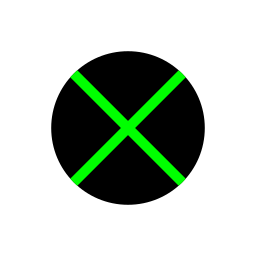

Circular clip region: fill + diagonals clipped to a circle.

*Cairo API: `cairo_clip()` · `cairo_new_path()`*

```tcl
set PI 3.14159265358979

set cr [tclmcairo::new 256 256]
$cr clear 1 1 1

# Clip to circle using SVG arc path
set r 76.8; set cx 128; set cy 128
$cr push
$cr clip_path "M [expr {$cx+$r}] $cy \
    A $r $r 0 1 0 [expr {$cx-$r}] $cy \
    A $r $r 0 1 0 [expr {$cx+$r}] $cy Z"

# Fill black rectangle
$cr set_source_rgb 0 0 0
$cr move_to 0 0; $cr line_to 256 0
$cr line_to 256 256; $cr line_to 0 256; $cr close_path
$cr fill

# Green diagonals
$cr set_source_rgb 0 1 0
$cr set_line_width 10
$cr move_to 0 0;   $cr line_to 256 256; $cr stroke
$cr move_to 256 0; $cr line_to 0 256;   $cr stroke
$cr pop
```

---

## curve to

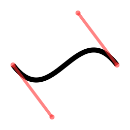

Cubic Bézier curve with control point lines.

*Cairo API: `cairo_curve_to()`*

```tcl
set x  25.6;  set y  128.0
set x1 102.4; set y1 230.4
set x2 153.6; set y2  25.6
set x3 230.4; set y3 128.0

set cr [tclmcairo::new 256 256]
$cr clear 1 1 1

$cr move_to  $x  $y
$cr curve_to $x1 $y1 $x2 $y2 $x3 $y3
$cr set_source_rgb 0 0 0
$cr set_line_width 10.0
$cr stroke

# Control lines
set hcol {1 0.2 0.2 0.6}
$cr line $x $y $x1 $y1 -color $hcol -width 6
$cr line $x2 $y2 $x3 $y3 -color $hcol -width 6

# Control points
foreach {px py} [list $x $y $x1 $y1 $x2 $y2 $x3 $y3] {
    $cr circle $px $py 5 -fill $hcol
}
```

---

## dash

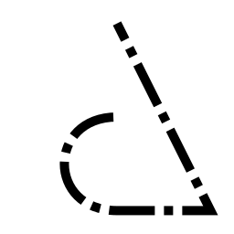

Dashed path using `-dash` and `-dash_offset`.

*Cairo API: `cairo_set_dash()` · `cairo_rel_line_to()`*

```tcl
set PI 3.14159265358979

set cr [tclmcairo::new 256 256]
$cr clear 1 1 1

$cr set_source_rgb 0 0 0
$cr set_line_width 10.0
$cr move_to 128.0 25.6
$cr line_to 230.4 230.4
$cr rel_line_to -102.4 0.0
$cr curve_to 51.2 230.4 51.2 128.0 128.0 128.0
$cr set_line_width 10.0

# Dash: 50 ink, 10 skip, 10 ink, 10 skip — offset -50
# tclmcairo: -dash {50 10 10 10} -dash_offset -50
# But we use low-level stroke here:
tclmcairo set_source_rgb [$cr id] 0 0 0
# Apply dash via path options on a helper proc
set id [$cr id]
tclmcairo move_to  $id 128.0 25.6
tclmcairo line_to  $id 230.4 230.4
tclmcairo rel_line_to $id -102.4 0.0
tclmcairo curve_to $id 51.2 230.4 51.2 128.0 128.0 128.0

# Use $cr path for dash support:
$cr new_path
$cr path "M 128 25.6 L 230.4 230.4 l -102.4 0 C 51.2 230.4 51.2 128 128 128" \
    -stroke {0 0 0} -width 10 -dash {50 10 10 10} -dash_offset -50
```

---

## fill and stroke

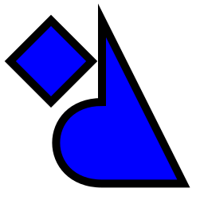

`fill_preserve` keeps the path for subsequent stroke.

*Cairo API: `cairo_fill_preserve()` · `cairo_stroke()`*

```tcl
set PI 3.14159265358979

set cr [tclmcairo::new 256 256]
$cr clear 1 1 1

$cr move_to 128.0 25.6
$cr line_to 230.4 230.4
$cr rel_line_to -102.4 0.0
$cr curve_to 51.2 230.4 51.2 128.0 128.0 128.0
$cr close_path

$cr move_to 64.0 25.6
$cr rel_line_to 51.2 51.2
$cr rel_line_to -51.2 51.2
$cr rel_line_to -51.2 -51.2
$cr close_path

$cr set_line_width 10.0
$cr set_source_rgb 0 0 1
$cr fill_preserve
$cr set_source_rgb 0 0 0
$cr stroke
```

---

## fill style

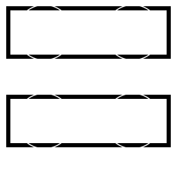

`evenodd` vs `winding` fill rule with `new_sub_path`.

*Cairo API: `cairo_set_fill_rule()` · `cairo_new_sub_path()`*

```tcl
set PI 3.14159265358979

set cr [tclmcairo::new 256 256]
$cr clear 1 1 1

$cr set_line_width 6
# Top: even-odd
$cr rect 12 12 232 70 -stroke {0 0 0} -width 6
$cr new_sub_path; $cr arc 64  47 40 0 360
$cr new_sub_path; $cr arc_negative 192 47 40 0 -360

$cr set_fill_rule evenodd
$cr set_source_rgb 0 0.7 0
$cr fill_preserve
$cr set_source_rgb 0 0 0; $cr stroke

# Bottom: winding
$cr transform -translate 0 128
$cr rect 12 12 232 70 -stroke {0 0 0} -width 6
$cr new_sub_path; $cr arc 64  47 40 0 360
$cr new_sub_path; $cr arc_negative 192 47 40 0 -360

$cr set_fill_rule winding
$cr set_source_rgb 0 0 0.9
$cr fill_preserve
$cr set_source_rgb 0 0 0; $cr stroke
```

---

## gradient

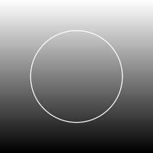

Linear gradient (top→bottom) + radial gradient.

*Cairo API: `cairo_pattern_create_linear/radial()`*

```tcl
set PI 3.14159265358979

set cr [tclmcairo::new 256 256]
$cr clear 1 1 1

# Linear gradient: white top to black bottom
$cr gradient_linear lin 0 0 0 256 {{0 1 1 1 1} {1 0 0 0 1}}
$cr set_source -gradient lin
$cr move_to 0 0; $cr line_to 256 0
$cr line_to 256 256; $cr line_to 0 256; $cr close_path
$cr fill

# Radial gradient (tclmcairo: cx cy r — no separate focal point)
$cr gradient_radial rad 128 128 76.8 {{0 1 1 1 1} {1 0 0 0 1}}
$cr set_source -gradient rad
$cr arc 128 128 76.8 0 360
$cr fill
```

---

## multi segment caps

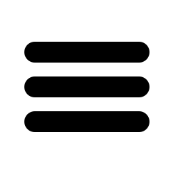

Three parallel lines with `round` line cap.

*Cairo API: `cairo_set_line_cap(ROUND)`*

```tcl
set cr [tclmcairo::new 256 256]
$cr clear 1 1 1

set col {0 0 0}
$cr set_source_rgb 0 0 0
$cr set_line_width 30.0
$cr set_line_cap round

$cr move_to  50.0  75.0; $cr line_to 200.0  75.0; $cr stroke
$cr move_to  50.0 125.0; $cr line_to 200.0 125.0; $cr stroke
$cr move_to  50.0 175.0; $cr line_to 200.0 175.0; $cr stroke
```

---

## rounded rectangle

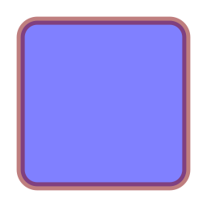

Rectangle with rounded corners via `-radius`.

*Cairo API: `cairo_arc()` for corners (tclmcairo: `-radius`)*

```tcl
set cr [tclmcairo::new 256 256]
$cr clear 1 1 1

# tclmcairo has built-in -radius for rect:
$cr rect 25.6 25.6 204.8 204.8 -radius 20.48 \
    -fill {0.5 0.5 1} -stroke {0.5 0 0 0.5} -width 10.0
```

---

## set line cap

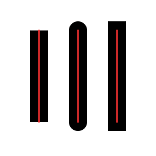

Comparison of `butt`, `round`, `square` line caps.

*Cairo API: `cairo_set_line_cap()` — butt · round · square*

```tcl
set cr [tclmcairo::new 256 256]
$cr clear 1 1 1
$cr set_source_rgb 0 0 0
$cr set_line_width 30.0

$cr set_line_cap butt
$cr move_to  64.0 50.0; $cr line_to  64.0 200.0; $cr stroke

$cr set_line_cap round
$cr move_to 128.0 50.0; $cr line_to 128.0 200.0; $cr stroke

$cr set_line_cap square
$cr move_to 192.0 50.0; $cr line_to 192.0 200.0; $cr stroke

# helping lines
$cr set_source_rgb 1 0.2 0.2
$cr set_line_width 2.56
$cr move_to  64.0 50.0;  $cr line_to  64.0 200.0
$cr move_to 128.0 50.0;  $cr line_to 128.0 200.0
$cr move_to 192.0 50.0;  $cr line_to 192.0 200.0
$cr stroke
```

---

## set line join

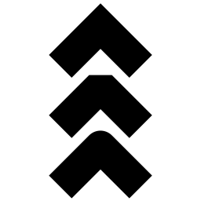

Comparison of `miter`, `bevel`, `round` line joins.

*Cairo API: `cairo_set_line_join()` — miter · bevel · round*

```tcl
set cr [tclmcairo::new 256 256]
$cr clear 1 1 1
$cr set_source_rgb 0 0 0

# miter (top)
$cr set_line_width 40.96
$cr set_line_join miter
$cr move_to  76.8  84.48
$cr rel_line_to  51.2 -51.2
$cr rel_line_to  51.2  51.2
$cr stroke

# bevel (middle)
$cr set_line_join bevel
$cr move_to  76.8 161.28
$cr rel_line_to  51.2 -51.2
$cr rel_line_to  51.2  51.2
$cr stroke

# round (bottom)
$cr set_line_join round
$cr move_to  76.8 238.08
$cr rel_line_to  51.2 -51.2
$cr rel_line_to  51.2  51.2
$cr stroke
```

---

## text

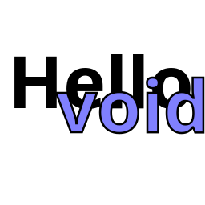

`show_text` + `text_path` (gradient fill, stroke outline).

*Cairo API: `cairo_show_text()` · `cairo_text_path()`*

```tcl
set PI 3.14159265358979

set cr [tclmcairo::new 256 256]
$cr clear 1 1 1

$cr set_source_rgb 0 0 0
$cr text 10 135 "Hello" -font "Sans Bold 90" -color {0 0 0}

# "void" as outlined text
$cr text 70 165 "void" -font "Sans Bold 90" \
    -fill {0.5 0.5 1} -stroke {0 0 0} -width 2.56 -outline 1

# helping lines: anchor points
$cr set_source_rgba 1 0.2 0.2 0.6
$cr arc 10 135 5 0 360; $cr fill
$cr arc 70 165 5 0 360; $cr fill
```

---

## text align center


Text centered using `font_measure` metrics.

*Cairo API: `cairo_text_extents()`*

```tcl
set PI 3.14159265358979

set cr [tclmcairo::new 256 256]
$cr clear 1 1 1

set utf8 "cairo"
set m [$cr font_measure $utf8 "Sans 52"]
set mw [lindex $m 0]; set mh [lindex $m 1]

set x [expr {128.0 - $mw/2.0}]
set y [expr {128.0 + $mh/2.0}]

$cr set_source_rgb 0 0 0
$cr text $x $y $utf8 -font "Sans 52" -color {0 0 0} -anchor sw

# helping lines
$cr set_source_rgba 1 0.2 0.2 0.6
$cr set_line_width 6.0
$cr arc $x $y 10.0 0 360; $cr fill
$cr move_to 128 0;   $cr rel_line_to 0 256
$cr move_to 0 128.0; $cr rel_line_to 256 0
$cr set_line_width 2
$cr stroke
```

---

## text extents

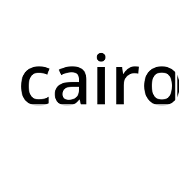

Bounding box from `font_measure` drawn around text.

*Cairo API: `cairo_text_extents()` — bounding box*

```tcl
set PI 3.14159265358979

set cr [tclmcairo::new 256 256]
$cr clear 1 1 1

set utf8 "cairo"
set m [$cr font_measure $utf8 "Sans 100"]
set mw [lindex $m 0]; set mh [lindex $m 1]
set asc [lindex $m 2]

set x 25.0; set y 150.0

$cr set_source_rgb 0 0 0
$cr text $x $y $utf8 -font "Sans 100" -color {0 0 0} -anchor sw

# bounding box
$cr set_source_rgba 1 0.2 0.2 0.6
$cr set_line_width 6.0
$cr arc $x $y 10.0 0 360; $cr fill

$cr move_to $x $y
$cr rel_line_to 0 [expr {-$mh}]
$cr rel_line_to $mw 0
$cr rel_line_to 0 $mh
$cr set_line_width 3
$cr stroke

# baseline dot
$cr arc $x $y 4 0 360; $cr fill
```

---

